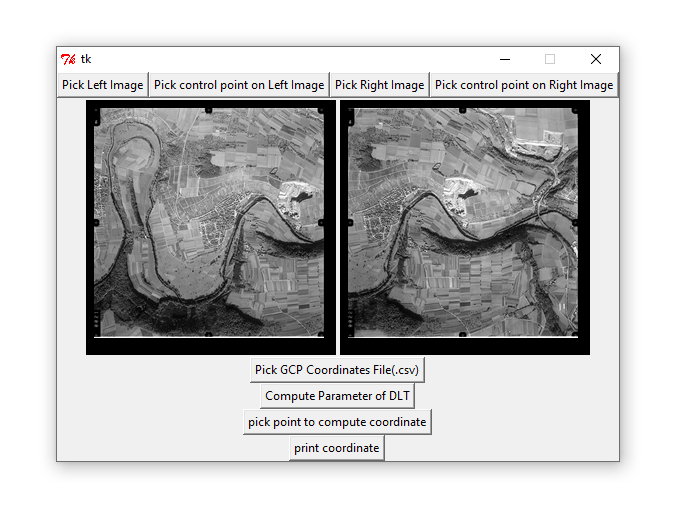

# Direct Linear Transformation (DLT) - Photogrammetry II Project

This repository contains a graphical user interface (GUI) application developed for the **Photogrammetry III** course at the **University of Isfahan**. The project, completed during my undergraduate studies in **Geomatics Engineering**, was designed for educational purposes to demonstrate the use of **Direct Linear Transformation (DLT)** in photogrammetry in Fall 2018.

## Overview of Direct Linear Transformation (DLT)

DLT is a widely used method in photogrammetry for mapping coordinates from two-dimensional images to three-dimensional ground-based coordinates. This method is particularly useful when working with Ground Control Points (GCPs) for 3D reconstruction or spatial analysis of images. It uses a set of known 3D points (in object space) and their 2D counterparts (in image space) to calculate a transformation model that estimates unknown parameters. The model allows for reconstructing object coordinates by determining projection parameters based on the positions of GCPs.

For further details on Direct Linear Transformation, you can refer to [this resource on DLT from Purdue University](https://engineering.purdue.edu/CCE/Academics/Groups/Geomatics/DPRG/Courses_Materials/Photogrammetry_2020Fall/AKAM_DLT_CV_AKAM).

## Project Features

The GUI application allows users to:
1. **Load Two Images**: Upload one image to the left and one to the right panel.
2. **Select GCP Coordinates**: Load a `.txt` file containing the known coordinates of GCPs in the ground coordinate system.
3. **Specify Points on Images**: Define the location of GCPs on both images to set up the model.
4. **Run DLT Models**: Calculate DLT parameters based on the provided GCPs and images.
5. **Compute Ground-Based Coordinates**: By selecting a point on one of the images, the application calculates its X, Y, and height coordinates in the ground-based coordinate system using the DLT parameters.

## Technologies Used

- **Python 2.7**
- **Libraries**:
  - `pillow` for image handling
  - `numpy` for numerical computations
  - `matplotlib` for plotting data and GUI elements
  - `opencv` for image processing
  - `sympy` for symbolic calculations

## Screenshots

### Main Interface

## Usage

To use this application:
1. Load two images (left and right side).
2. Import a `.txt` file containing the ground coordinates for GCPs.
3. Mark corresponding GCPs on each image.
4. Run the DLT model to calculate transformation parameters.
5. Select a point to estimate its 3D coordinates in the ground-based system.

## Note
If you have any questions about this project, feel free to reach out.
